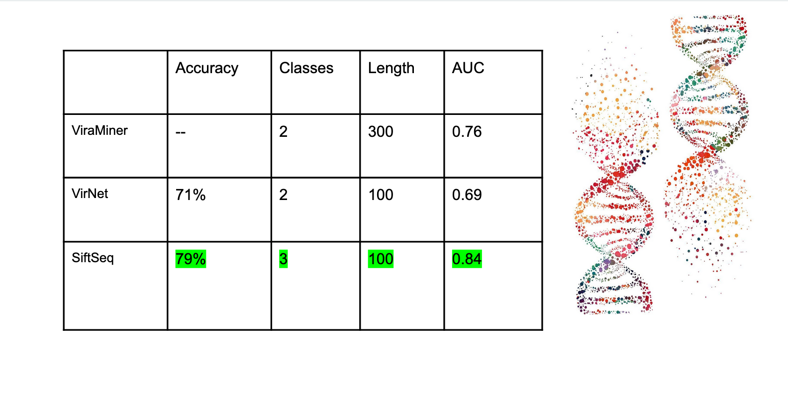

# SiftSeq
A state-of-the-art CNN+LSTM neural network model that predicts whether short sequences of DNA are viral, human, or bacterial in origin

# Performance
SiftSeq significantly outperforms benchmarks set by the recent classifiers ViraMiner and VirNet, while being able to handle more classes and shorter sequences.


# Contents

- **data**: contains small fasta files used for checking that things run properly

- **saved_models**: saved models produced during training

- **sift_seq**: scripts used in training and prediction

- **Dockerfile**: the file from which the docker image for this project is built

# Installation

1. If you do not yet have it, download [Docker](https://www.docker.com/get-started).

2. Pull the docker image for SiftSeq from Docker Hub. On the command line, type

```shell
docker pull elanstop/sift-seq:latest
```
3. Run a container from this image. On the command line, type

```shell
docker run -it elanstop/sift-seq:latest
```

# Usage

To examine predictions, e.g., for the input file all_raw_reads.fasta contained in the data folder, cd to the sift_seq directory within the container and run

```shell
python make_prediction.py all_raw_reads.fasta output.csv
```

where output.csv is the chosen name of the output file that will hold the predictions. More generally, input files stored on your machine may be copied to the container using [docker cp](https://docs.docker.com/engine/reference/commandline/cp/).

To train the model using the example data, cd to the sift_seq directory within the container and run:

```shell
python train.py
```

Trained models are saved in the saved_models folder after each epoch and labelled with their validation accuracy. To supply your own training data, simply use [docker cp](https://docs.docker.com/engine/reference/commandline/cp/) to transfer files to the container, and modify the paths within train.py to point to your chosen files.

# Contact

Elan Stopnitzky, e.stopnitzky@gmail.com


